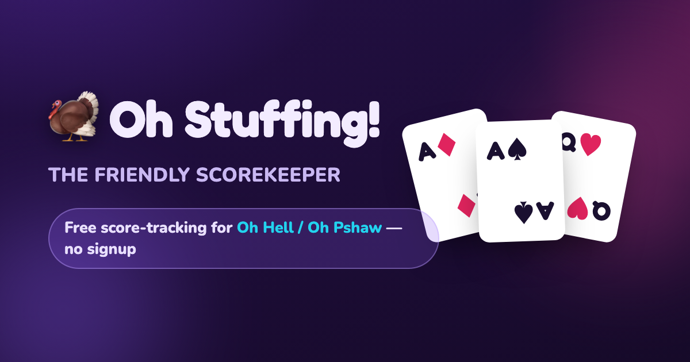

# 🦃 Oh Stuffing! — the friendly scorekeeper

A playful, phone-friendly scoreboard for the trick-taking card game **Oh Stuffing** (a.k.a. *Oh Hell / Oh Pshaw / Nomination Whist*). No accounts, no server — everything runs in your browser and saves automatically as you play. Light and dark themes included.

👉 **Live app:** https://btarcau.github.io/oh-stuffing/



## How scoring works

Each round every player **bids** how many tricks they think they'll win, then you record how many they actually **made**:

- **Hit your bid exactly** → `10 + tricks won` (bid 0 & made 0 = **10**, bid 2 & made 2 = **12**)
- **Miss your bid** (over *or* under) → just the **tricks you won**, no bonus

Scores are cumulative across the whole game.

## The rounds

Hand sizes ramp automatically based on how many players you add:

```
N ones  →  2, 3, 4 … up to the max  →  back down … 3, 2  →  N ones
```

The max hand is `52 ÷ players` (6 players → up to 8 cards, 5 players → up to 10). The dealer rotates one seat each round and — per the classic rule — **can't bid the number that would make everyone's bids add up to the exact number of cards dealt**, so someone always gets stuffed. The app enforces this for you.

## Using it

1. **Add players** — rounds adjust as you type. Hit **Done**.
2. **Set the order** — drag or use the arrows; the top seat deals first.
3. **Play** — enter each player's bid and made for the round. It won't let you continue until the tricks add up and the dealer's bid is legal. Everything saves on every tap.
4. **Scoreboard** — live leaderboard, a full round-by-round grid (with rank movement ▲▼), and game stats (average round time, misses, biggest round, and more).

On a phone you get two tabs (**Entry** / **Scoreboard**); on a tablet or computer they sit side by side.

## Running locally

It's plain static files — just open `index.html`, or serve the folder:

```bash
python3 -m http.server 8000
# then visit http://localhost:8000
```

## Tech

Vanilla HTML/CSS/JavaScript, no build step, no dependencies. State persists in `localStorage`.

---

<sub>Also known as: **Oh Hell**, **Oh Pshaw**, **Oh Well**, **Nomination Whist**, **Blackout**, **Bust**, **Wizard**-style bidding. A free online score sheet / score tracker / scoreboard app for this trick-taking bidding card game.</sub>
